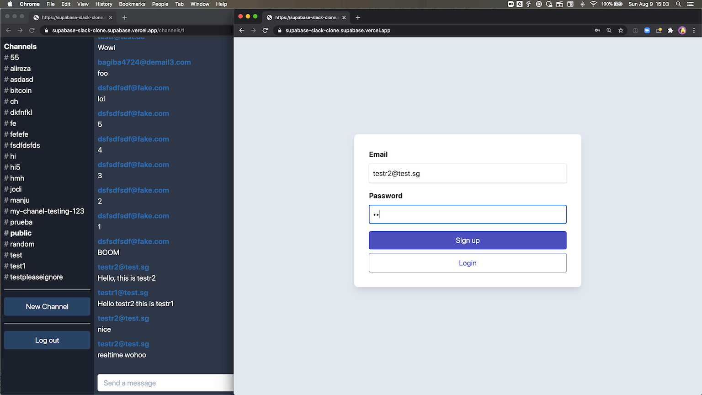

# Realtime chat example using Supabase

This is a full-stack Slack clone example using:

- Frontend:
  - Next.js.
  - [Supabase.js](https://supabase.com/docs/library/getting-started) for user management and realtime data syncing.
- Backend:
  - [app.supabase.io](https://app.supabase.io/): hosted Postgres database with restful API for usage with Supabase.js.

## Demo

- Live demo: http://supabase-slack-clone-supabase.vercel.app/
- CodeSandbox: https://codesandbox.io/s/github/supabase/supabase/tree/master/examples/nextjs-slack-clone
- Video tutorial: https://www.loom.com/share/31eec9b656e44b8d87c88bde8a465676



## Deploy your own

### 1. Create new project

Sign up to Supabase - [https://app.supabase.io](https://app.supabase.io) and create a new project. Wait for your database to start.

### 2. Run "Slack Clone" Quickstart

Once your database has started, run the "Slack Clone" quickstart.


### 3. Get the URL and Key

Go to the Project Settings (the cog icon), open the API tab, and find your API URL and `anon` key. You'll need these in the next step.

The `anon` key is your client-side API key. It allows "anonymous access" to your database, until the user has logged in. Once they have logged in, the keys will switch to the user's own login token. This enables row level security for your data. Read more about this [below](#postgres-row-level-security).


**_NOTE_**: The `service_role` key has full access to your data, bypassing any security policies. These keys have to be kept secret and are meant to be used in server environments and never on a client or browser.

### 4. Deploy the Next.js client

[](https://vercel.com/new/git/external?repository-url=https%3A%2F%2Fgithub.com%2Fsupabase%2Fsupabase%2Ftree%2Fmaster%2Fexamples%2Fnextjs-slack-clone&env=NEXT_PUBLIC_SUPABASE_URL,NEXT_PUBLIC_SUPABASE_KEY&envDescription=Find%20the%20Supabase%20URL%20and%20key%20in%20the%20your%20auto-generated%20docs%20at%20app.supabase.io&project-name=supabase-slack-clone&repo-name=supabase-slack-clone)

Here, we recommend forking this repo so you can deploy through Vercel by clicking the button above. When you click the button, replace the repo URL with your fork's URL.

You will be asked for a `NEXT_PUBLIC_SUPABASE_URL` and `NEXT_PUBLIC_SUPABASE_KEY`. Use the API URL and `anon` key from [step 3](#3-get-the-url-and-key).

### 5. Change authentication settings if necessary


On [app.supabase.io](https://app.supabase.io), you can go to Authentication -> Settings to change your auth settings for your project if necessary. Here, you can change the site URL, which is used for determining where to redirect users after they confirm their email addresses or attempt to use a magic link to log in.

Here, you can also enable external oauth providers, such as Google and GitHub.

## How to use

### Using `create-next-app`

Execute [`create-next-app`](https://github.com/vercel/next.js/tree/canary/packages/create-next-app) with [npm](https://docs.npmjs.com/cli/init) or [Yarn](https://yarnpkg.com/lang/en/docs/cli/create/) to bootstrap the example locally:

```bash
npx create-next-app --example with-supabase-auth-realtime-db realtime-chat-app
# or
yarn create next-app --example with-supabase-auth-realtime-db realtime-chat-app
```

## Running tdm

```
node dist/index.js <app-name> <api-key> <dry-run-boolean>
```
